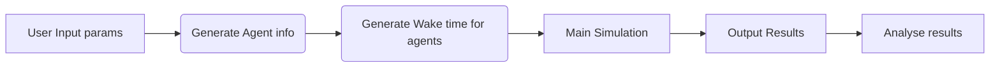
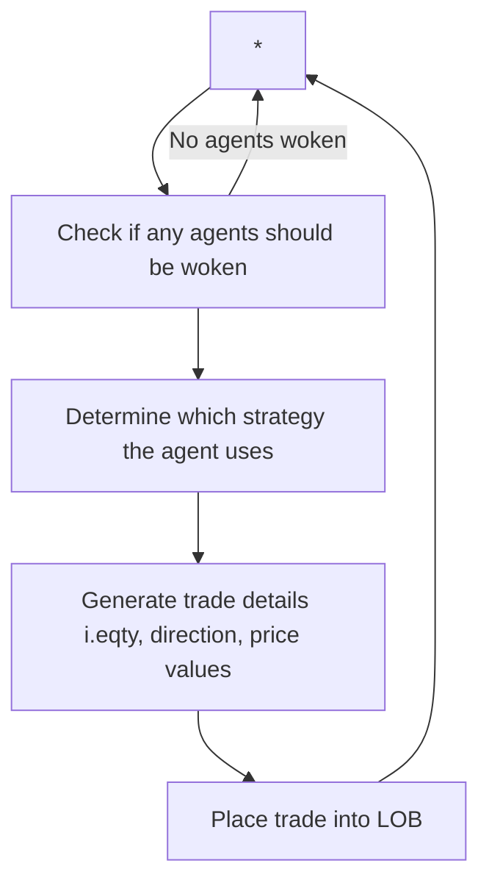

# Market Simulator dev
This is a repo for the development of my market simulator

# To run
1. Nagvigate to the directory to which you cloned this repo. And ensure "Market_Order_Simulator.py" is present.
2. python3 Market_Order_Simulator.py

# To edit parameters:
Edit the "Market_Order_Simulator.py" file.
All main parameters are contained at the start of this script - with appropriate descptors of what they do.
NOTE: Simulation time is measuresd in milliseconds. i.e 1000*60 is 1 Minute

NOTE: For agent generation changes, you may need to scroll down a litter further
This is also true for results analysis and plotting.

Folder Structure 
============================

### Directory layout

    .
    ├── Market_Order_Simulator.py       # Main script to run Market Order (only) Simulator ^^
    ├── Limit_Order_Simulator.py        # Main script to run Limit Order Simulator 
    ├── Agents                     		# Folder containing scripts for agent related functions 
    │   ├── Agent_Generation.py         # Functions to generate agent types
    │   ├── Agent_Timings.py         	# Functions to generate the "wake" times for agents, used to trigger decisions of if/how they will trade.
    │   └── Agent_Strategies.py         # Specifies the Strategy Agents use.
    ├── Analysis	          			# For analysing the output of the simulation
    │   └── Results_and_Analysis.py     # Functions for plotting, saving and analysing simulation output.
    ├── LOB                    			# Class for Limit Orderbook generation and processing. 
    │   └── orderbook_timed.py         	# A fast limit order book implementation. (Orderbook function that is used. Ignore the others)
    ├── Main_Simulator                  # Main functions for running the market simulation 
    │   ├── Simulator.py         		# Functions to run main simulation. Market Order only
    │   └── Simulator_LOB.py         	# Functions to run main simulation. For Limit Orders
    ├── utils                   		# Some helper functions.
    │   └── utils.py         			# Functions to help. i.e Get current path, Converting times, create historical prices
    └── README.md

Flow of Process for Simulation 
============================

### Full Simulation Process

Detailed Main Simulation 
============================

### Detailed Main Simulation Flow

