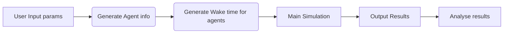
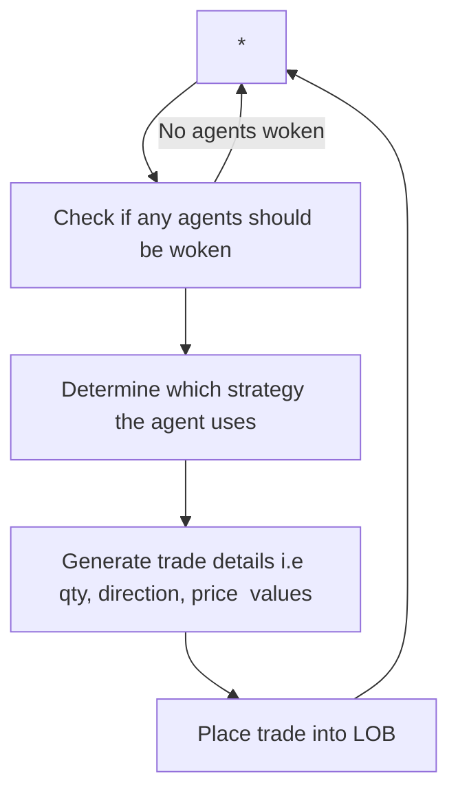

# Market Simulator dev
This is a repo for the development of a market simulator.

Running the Simulator
============================
# To run
1. Nagvigate to the directory to which you cloned this repo. And ensure ***Market_Order_Simulator.py*** or ***Limit_Order_Simulator.py*** is present.
2. Execute the command: ***python3 Market_Order_Simulator.py*** or ***python3 Limit_Order_Simulator.py***

# To edit parameters:
Edit the ***Market_Order_Simulator.py*** or ***Limit_Order_Simulator.py*** file.
All main parameters are contained at the start of this script - with appropriate descptors of what they do.
NOTE: Simulation time is measuresd in milliseconds. i.e 1000*60 is 1 Minute

NOTE: For agent generation changes, you may need to scroll down a litter further
This is also true for results analysis and plotting.

# How this simulator works
The simulator is an Agent Based Discrete Event Simulator, in which a set a of agent (of various types) are generated and woken with varying frequencies.
### Agent types: 
	1. Random Agent - Randomly generates a price and quantity. These values are calculated using a normal distribution, where trade sizes and prices are sized according to trade frequency. i.e An agent that trades frequently will have smaller trade sizes and prices closer to the current price than those that trade less frequently.
	2. Trend Following Agent - Determine if the nth previous trade is larger or smaller than the current price. Trade accordingly. i.e Sell if the current price is smaller than the previous. 
	3. Mean Reverting Agent - Calculate the mean of the last n trades then trade accordingly. i.e Sell if the current price is larger than the mean of the last n trades.

### MARKET ORDER SIMULATOR
This simulator only considers market orders. It assumes a very thing orderbook, where each quantity or unit, causes the price to move 1 price increment. i.e  +3 Amont = +3 Price.
This is not hugely realistic, however we can see that some typical market patterns emerge. 

### LIMIT ORDER SIMULATOR
This version of the simulator uses a Limit Order Book (LOB) to track and execute trades. (Based on an altered version of https://github.com/kmanley/orderbook). I reccomend using this version. 

Example Output
============================

### Sample Output
Example Market Orders Only             |  Example Market Orders Only
:-------------------------:|:-------------------------:
  |  

Example Limit Orders             |  Example Limit Orders
:-------------------------:|:-------------------------:
  |  

Spike Agents - Varied             |  Spike Agents Create Resistence
:-------------------------:|:-------------------------:
  |  

### Output from previous Simulation (LOB)
The below image shows the volume being traded by each agent type at a given time. 
We are able to observe that when the agent type "mean" and "trend" cross over we see a "flat" point within the price. And when they "switch" prominence we see a reversal in price. (This reversal does not occur in all instances - other trials have shown that it may continue in the same direction, however it always alters the gradient of the curve, and a "flat" patch occurs in all cases. )

Folder Structure 
============================

### Directory layout

    .
    ├── Market_Order_Simulator.py       # Main script to run Market Order (only) Simulator
    ├── Limit_Order_Simulator.py        # Main script to run Limit Order Simulator 
    ├── Agents                     		# Folder containing scripts for agent related functions 
    │   ├── Agent_Generation.py         # Functions to generate agent types
    │   ├── Agent_Timings.py         	# Functions to generate the "wake" times for agents, used to trigger decisions of if/how they will trade.
    │   └── Agent_Strategies.py         # Specifies the Strategy Agents use.
    ├── Analysis	          			# For analysing the output of the simulation
    │   └── Results_and_Analysis.py     # Functions for plotting, saving and analysing simulation output.
    ├── LOB                    			# Class for Limit Orderbook generation and processing. 
    │   └── orderbook_timed.py         	# A fast limit order book implementation. (Orderbook function that is used. Ignore the others)
    ├── Main_Simulator                  # Main functions for running the market simulation 
    │   ├── Simulator.py         		# Functions to run main simulation. Market Order only
    │   └── Simulator_LOB.py         	# Functions to run main simulation. For Limit Orders
    ├── Sample Images                   # Images of Previous SImulation - to provide samples 
    │   └── ....         				# Various images
    ├── utils                   		# Some helper functions.
    │   └── utils.py         			# Functions to help. i.e Get current path, Converting times, create historical prices
    └── README.md

Flow of Process for Simulation 
============================

### Full Simulation Process

Detailed Main Simulation 
============================

### Detailed Main Simulation Flow

